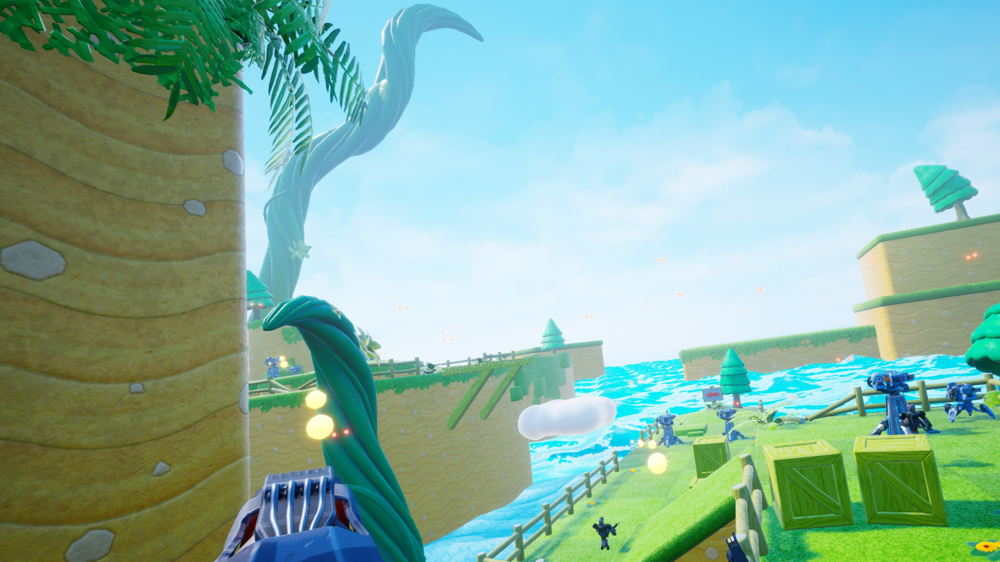

# TheArmyIsYou

The army is you is a student VR project scoping a small action shooter game.

[Download here](https://github.com/Ikeiwa/TheArmyIsYou/releases/latest)

In this game, you shoot your way through an unbrearable bullet hell. 
Using different weapons, you can destroy turrets or block their shots, each time starting over when you get hit. But there's a catch: for each death, a clone will play the actions of your previous lives, helping you get past the barrage!
